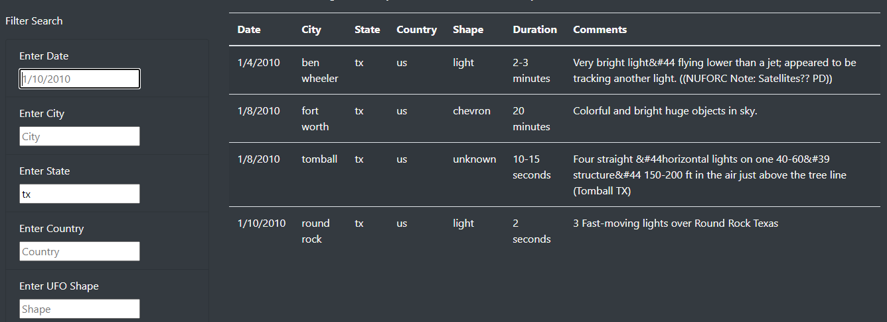
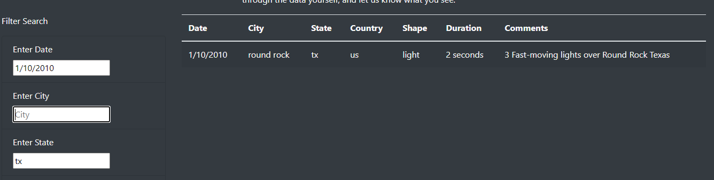

# UFO Sightings

### Project Overview
Deploy a webpage utilizing javascript, html, and bootstrap css. The webpage features a table which can be dynamically filtered, allowing visitors to quickly and easily find specific information in a large dataset. 

### Using the webpage
Users can filter data based on 5 criteria by typing in values into text input boxes. For example, if someone wanted to see all of the UFO sightings in the state of Texas they can input "tx" into the State filter field and the table will automatically update to show only the filtered data. 

Additional filters can be added by typing in options in other filter input fields. 

 

### Summary
One drawback of the new design is how specific the filters need to be to handle user input. For example, a filter for USA will return nothing because all data from the United States is in the table as "us". Unless the case matches exactly the table will not return any information which could be confusing to users visiting the site. 

One improvement could be to add different options for the filtering process such as a drop down menu. Doing so would limit the error handling needed on the backend and also give the user more accurate data. 

Another option would be to add more dynamic features to the table such as summary data for the year with the most sightings, or the state with the most sightings. Table sorting could also be a development option. Sorting would allow users to see sightings in specific areas by date, or sort alphabetically by state to parse through the entire dataset more efficiently. 
